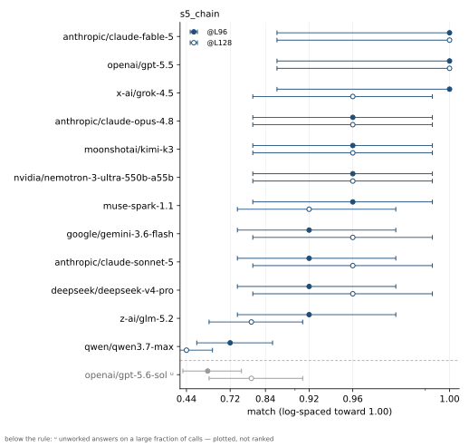

# FactWorld

**An instrument to test how recall and state tracking compose, in pre-trained models and in architecture explorations.**

Recall is well tested by multi-query associative recall (MQAR); state tracking by the word-problem
literature on S₅ (order-sensitive permutation composition). FactWorld tests both, independently 
*and* in composition, under one protocol for frontier models over an API and for small models 
trained from scratch. 

Every task is a frozen, versioned ``TaskSpec`` rendered as natural language over a constrained vocabulary, 
with deterministic examples; gold answers come from a symbolic oracle, never from parsing rendered
text, and a validity gate certifies that no shallow baseline clears floor. 


## 1. The tasks

| | task | notes |
|---|---|---|
| **Component: recall** | `recall_copy_v1` | single-query, deferred-readout MQAR variant; pool breadth = load axis |
| — parametric variant | `recall_v1` / `conflict_v1` | retrieval from weights (local models); `conflict_v1` scores the in-context override |
| **Component: state tracking** | `binding_v2` | last-write-wins (absorbing updates, not group ops) |
| — commutative variant | `commutative_v1` | each event turns a named entity's dial a few clicks; the query asks where one dial ends up (every event matters, order does not); experimental: reads in the thinking regime only, so it stays off the headline |
| — non-abelian variant | `s5_v1` | order-sensitive permutation streams; length = sequence stress |
| **Composition: state × recall** | `composite_copy_v2` | the two-hop; the **gap** (binding − composed) is its derived statistic |
| **Composition: recall ∘ recall** | `chain_v2` | follow a chain of "ask X" pointers hop by hop to the fact at the end; recall applied to its own output; depth = number of hops at fixed breadth |
| **Composition: non-abelian state × serial dereference** | `s5_chain_v3` | the **FactWorldBench headline task**: track a k=16 pointer map through L order-sensitive swap/cycle events, then dereference it 8 hops deep; items gated so echo/fixed-hop heuristics score exactly 0 (chance 1/16) |

Each axis tests a different thing: solve rate; pool/breadth (working-set load); depth/length
(iteration count); regime (**instant** = reasoning off + answer contract = in-weights, vs
**thinking** = generous budget); reasoning tokens needed to solve. 

Scale any task to stress larger models via explicit difficulty knobs:

```python
hard = CANONICAL["composite_copy_v2"].scaled(k=64, eval_lengths=(32, 64, 128))
```

Floors are first-class rows and marks are plain-language.

## Using it

The data / oracle / eval layer is pure-stdlib. Backends are
installed via extras:

```bash
# Core only: enough to generate tasks and score predictions
pip install -e .

# Add the backends you need
pip install -e ".[train]"     # local from-scratch training (torch + flash-linear-attention)
pip install -e ".[hf]"        # HuggingFace transformers
pip install -e ".[api]"       # OpenAI-compatible APIs
pip install -e ".[dev]"       # pytest + hf/api/train backend deps
```

```python
from factworld.backends import FunctionBackend
from factworld.runner import evaluate_task
from factworld.tasks import CANONICAL

spec    = CANONICAL["composite_copy_v2"]    # binding × in-context-copy recall, in one query
backend = FunctionBackend(
    lambda prompts, n, stop: ["g0 ."] * len(prompts),
    name="always-g0",
)
result  = evaluate_task(backend, spec, n=50)  # deterministic; gold from the oracle
print(result["overall"])
```

```bash
# API fair eval for reasoning models (2048 tokens, no early stop)
python scripts/eval_model.py composite_copy_v2 --backend api --model gpt-4o-mini --n 50 --no_stop

# HuggingFace
python scripts/eval_model.py composite_copy_v2 --backend hf --model meta-llama/Llama-2-7b-hf --n 50

# Local from-scratch
python scripts/run_benchmark.py composite_copy_v2 --arch gdp_hybrid --d_model 320 --steps 8000

# Run a grid of OpenRouter models (set OPENROUTER_API_KEY)
python scripts/eval_openrouter_grid.py --n 30

# Hybrid / state-space models on OpenRouter (disable built-in chain-of-thought)
python scripts/eval_openrouter_grid.py \\
    --models nvidia/nemotron-3-ultra-550b-a55b moonshotai/kimi-k3 \\
    --n 30 --composite_format --no_reasoning

# Evaluate a local model and merge it into the OpenRouter table
python scripts/eval_model.py composite_copy_v2 --backend local --arch gdn_hybrid \\
    --d_model 320 --steps 8000 --n 50 --json_out results/local-gdn.json
python scripts/merge_grid_results.py docs/openrouter-results.json results/local-gdn.json \\
    --out docs/combined-results.md

python -m factworld.tasks             # suite self-test (determinism + oracle round-trip)
python scripts/validate_suite.py      # validity gate: no shallow shortcut clears floor
```

> **Composite-format note:** the API and HuggingFace backends automatically append
> an output-format instruction for composite-family tasks (e.g. ``composite_copy_v2``)
> so chat models emit the required ``<holder> <value> .`` answer span. Use
> ``--no-composite-format`` to disable it (e.g. for ablations).

To evaluate your own model, implement the ``ModelBackend`` interface and pass it to
``factworld.runner.evaluate_task`` (or wrap any callable in ``FunctionBackend`` as above):

```python
from factworld.runner import evaluate_task
from factworld.backends import ModelBackend
from factworld.tasks import CANONICAL

class MyBackend(ModelBackend):
    @property
    def name(self):
        return "my-backend"

    def generate(self, prompts: list[str], max_new_tokens: int,
                 stop_at: str | None = None) -> list[str]:
        # Return one continuation per prompt, not including the prompt.
        return [my_model.complete(p, max_tokens=max_new_tokens) for p in prompts]

spec = CANONICAL["composite_copy_v2"]
result = evaluate_task(MyBackend(), spec, n=50)
print(result["overall"])
```

See [`docs/USAGE.md`](docs/USAGE.md) for the full backend API reference, API
cost tips, and a custom-backend example. Concrete prompts, gold answers, and real model
mistakes for every task are in [`docs/tasks.md`](docs/tasks.md).

## 2. Benchmarking the frontier

To give an easier view of performance we track one composed task, **s5_chain**: non-abelian
pointer-map tracking composed with an 8-hop serial dereference in a single task. The table
reports the match score at two lengths (96 and 128 permutation events), plus completion tokens
per call on the matched L64 cell. Nearly every model solves that length, so token spend
compares like for like.

Models run at the recommended top reasoning level, `xhigh` (mapped down where the endpoint's
ceiling is `high`).

More details in [§4 of the report](reports/factworld.pdf); per-cell Wilson
intervals, marks, and figures are in the [rendered feed](docs/benchmark/results.md).

<!-- FRONTIER_TABLE_START -->
**s5_chain**

| Model | s5_chain @L96 | @L128 | ctok/call @L64 |
|---|---|---|---|
| anthropic/claude-fable-5 | 1.00 | 1.00 | 5014 |
| openai/gpt-5.5 | 1.00 | 1.00 | 9343 |
| x-ai/grok-4.5 | 1.00 | 0.96 | 7711 |
| anthropic/claude-opus-4.8 | 0.96 | 0.96 | 9702 |
| moonshotai/kimi-k3 | 0.96 | 0.96 | 10941 |
| nvidia/nemotron-3-ultra-550b-a55b | 0.96ʳ | 0.96 | 17071 |
| muse-spark-1.1 | 0.96 | 0.92 | 12484 |
| google/gemini-3.6-flash | 0.92 | 0.96 | 8166 |
| anthropic/claude-sonnet-5 | 0.92 | 0.96 | 12729 |
| deepseek/deepseek-v4-pro | 0.92 | 0.96 | 17052 |
| z-ai/glm-5.2 | 0.92 | 0.80 | 17982 |
| qwen/qwen3.7-max | 0.72 | 0.44 | 12588 |
| openai/gpt-5.6-sol | 0.60 | 0.80 | 2444 |

**Component: instant composition (reasoning off, answer contract)**

| Model | binding @L16 | composed @L16 | composed @L64 | gap |
|---|---|---|---|---|
| anthropic/claude-opus-4.8 | 0.78 | 0.72 | 0.43 | +0.06 |
| google/gemini-3.6-flash | 0.69* | 0.67* | 0.26* | +0.02* |
| openai/gpt-5.6-sol | 0.82 | 0.65 | 0.33 | +0.17 |
| anthropic/claude-sonnet-5 | 0.77 | 0.62† | 0.32† | +0.15† |
| openai/gpt-5.5 | 0.80 | 0.46 | 0.33 | +0.34 |
| deepseek/deepseek-v4-pro | 0.51 | 0.44 | 0.19 | —ᶠ |
| z-ai/glm-5.2 | 0.71 | 0.38† | 0.13 | +0.33† |
| moonshotai/kimi-k3 | 0.65 | 0.33 | 0.29 | +0.32 |
| nvidia/nemotron-3-ultra-550b-a55b | 0.49 | 0.33 | 0.12 | —ᶠ |
| qwen/qwen3.7-max | 0.51 | 0.24 | 0.08 | —ᶠ |
| *recency heuristic (floor)* | 0.04 | 0.04 | 0.06 | — |
| *object-filter floor* | 0.41 | 0.41 | 0.15 | — |

**Components: thinking state stress (reasoning on)**

| Model | chain d128 | s5 @L256 | s5@128 ctok |
|---|---|---|---|
| anthropic/claude-fable-5 | 1.00 | 1.00 | 6405 |
| openai/gpt-5.5 | 1.00 | 1.00 | 6989 |
| google/gemini-3.6-flash | 0.96 | 1.00 | 8234 |
| muse-spark-1.1 | 1.00 | 1.00 | 9704 |
| deepseek/deepseek-v4-pro | 1.00 | 1.00 | 10043 |
| anthropic/claude-sonnet-5 | 1.00 | 1.00 | 11866 |
| anthropic/claude-opus-4.8 | 1.00 | 1.00 | 12683 |
| openai/gpt-5.6-sol | 0.88 | 0.92 | 2657 |
| x-ai/grok-4.5 | 1.00 | 0.88 | 8069 |
| qwen/qwen3.7-max | 0.96 | 0.80 | 7904 |
| moonshotai/kimi-k3 | 1.00 | 0.80 | 11355 |
| nvidia/nemotron-3-ultra-550b-a55b | 0.60 | 0.80 | 12250 |
| z-ai/glm-5.2 | 0.92 | 0.76 | 6282 |
<!-- FRONTIER_TABLE_END -->



n=25 per cell; bars are Wilson 95% intervals.

Marks:
- `†` visible working or covert reasoning on the canonical attempt.
- `≤x†` an explicit upper bound (covert reasoning on most calls); neither `⊘` nor `≤x†` participates in orderings.
- `*` off-arm ran effort=minimal (cannot disable reasoning).
- `ʳ` single rerun at a raised 32,768-token budget.
- `‡` provider ignored the token cap.
- `⊘` not measurable at this budget (majority finish=length).
- `—ᶠ` gap not interpretable (binding at the object-filter floor).
- `n/a` cell not run; `—` not applicable to a floor row.

Reading the component tables: **gap** = binding minus composed @L16, the accuracy lost when
the model must chain the recall step onto the state it just tracked. The two floor rows are
the shallow baselines every instant cell is read against: the *recency heuristic* answers the
last event's recipient, and the *object-filter floor* filters events to the queried object but
guesses among its writes. An instant score near 0.41 shows object filtering, not state
tracking. In the thinking table, chain d128 is a 128-hop pointer chase over 257 agents and
s5 @L256 is 256 role-permutation events (both described in [the tasks](#1-the-tasks) and
[docs/tasks.md](docs/tasks.md)). Efficiency is priced at a lower length than the score in both
tables for the same reason: token spend only compares like for like on a cell every model
completes. At the scoring lengths some models truncate or run at different budgets, so spend
there measures the budget, not the cost to solve. Three models (grok-4.5, muse-spark-1.1,
claude-fable-5) appear only in the thinking tables: their endpoints cannot disable reasoning,
so they have no instant cells.

## 3. Exploring the architectures

We can train from-scratch models on the same tasks with next-token prediction. Supervision is
answer-only by default, with a staged curriculum for the composite flagship; dense per-step
supervision appears only where it is the measured lever (the s5 and commutative formation
results below). Currently we explore:

* **transformer**: a standard decoder-only stack, the attention baseline.
* **gdn_pure / gdn_hybrid**: [GatedDeltaNet](https://arxiv.org/abs/2412.06464), gated
  delta-rule linear attention; *pure* is attention-free, *hybrid* interleaves one full-attention
  layer per four.
* **gdp_pure / gdp_hybrid**: [GatedDeltaProduct](https://arxiv.org/abs/2502.10297), the delta
  rule generalized to a product of Householder transformations per token (n_h=4). This is the
  non-commutative recurrence the state-tracking results turn on; same pure/hybrid split.
* **fprm**: a weight-tied looped conv+attention block (after Movahedi et al., 2026); one block
  applied repeatedly, so per-token FLOPs match the transformer at ~5–11× fewer parameters.

Comparisons are matched on compute, not parameters, at budgets sufficient for the capable
configuration to converge.

- **Recall.** Every architecture aces adjacent 1-hop readout; deferred recall needs product
  recurrence: attention-free `gdp_pure` supplies it, `gdn_pure` fails
  ([report §3](reports/factworld.pdf)).
- **Binding under breadth.** fprm leads the binding leg through B16 and breaks at B24, where
  gdp_hybrid holds 0.67; the transformer reads 0.08–0.23 throughout (45 runs, d256).
- **Composition.** The staged-curriculum flagship converges only for gdp_hybrid: composite
  0.833±0.089 @L16 (3 seeds 0.758/0.782/0.958, eval_n=500; holder 0.999 / value 0.833); fprm
  0.109±0.089 with perfect binding (0.998) but a dead value leg; transformer 0.001, a real floor.
  Scale is non-monotone: convergence peaks at medium d768 (0.732±0.013 corroborates), small
  fails the value leg, large is seed-bimodal
  ([report §5.2](reports/factworld.pdf)).
- **Chain.** No architecture extrapolates depth (3 archs × 3 seeds): gdp_hybrid fits training
  best yet scores below the guess at held-out depths.
- **s5.** Dense per-step supervision forms the non-abelian circuit in every architecture; only
  the recurrent hybrid extrapolates length
  ([report §5.5](reports/factworld.pdf)).
- **Commutative.** Answer-only training reads chance for every architecture at d256; dense
  per-step traces form the fold in-distribution for the recurrent architectures (gdp_hybrid
  0.82, fprm 0.65 @L16; transformer at chance); no run carries it past the training
  lengths.
  
The price table shows which architectural or training choice buys each element, with per-row
evidence: [§6 of the report](reports/factworld.pdf). Local multi-seed detail and per-leg
decomposition are §5 of the report. Running log:
[`docs/experiments/README.md`](docs/experiments/README.md).

## Reports and prior work

- 📄 [`reports/factworld.pdf`](reports/factworld.pdf), **the report**: the instrument and its
  validation, the frontier benchmark, and the architecture exploration with the requirements
  table. Source is [`reports/factworld.tex`](reports/factworld.tex), built by
  `scripts/build_arxiv.sh`.
- 🧪 **Experiments using FactWorld as a testbed** live under
  [`experiments/`](experiments/):
  [`experiments/mopd/`](experiments/mopd/README.md), *Multi-teacher On-Policy Distillation*
  (MOPD) on FactWorld: RL-specialise Qwen3-1.7B on two abilities (binding, recall) with a
  verifiable reward, then distil both into one model that holds both (LoRA adapters on a shared
  backbone). See [`REPRODUCE.md`](experiments/mopd/REPRODUCE.md).

## Repository layout

```
phases/                  prior work, archived (ran on the atomic-token format)
  01-instrument/           original FactWorld paper (.md + .pdf)
  02-non-abelian-state/    non-abelian state-tracking report + reproduction kit
docs/
  tasks.md                concrete prompts, gold answers, and real model mistakes for every task
  USAGE.md                backend API reference and custom-backend examples
  related-work.md         related work with verified citations
  results.md              4-arch reference baselines (match metric)
  results-ci.md           3-seed CIs on the dissociating cells + attention-free recall ablation
  benchmark/              the FactWorldBench feed: rendered tables, figures, results.csv
  openrouter/             external LLM API grid results
    results.md              benchmark tasks
    s5-results.md           experimental `s5_v1` task
  recall/                 recall-capability results
    readout.md              attention-free recall readout
  composition/            composition-capability results
    results.md              small-scale composite diagnostic + decomposition
  state-tracking/         state-tracking-capability results
    dense-supervised.md     dense-supervised S5/A5 word problem (§3.1 probe)
    scale.md                archived k=5 compute-matched scale + LR sweeps (retired composite_copy_scale_v1; distinct from the report's §5 composite scale sweep)
factworld/                the instrument (torch-free data/oracle/eval + the model zoo)
  world.py, oracle.py     deterministic KB + symbolic ground-truth solver
  render.py               template renderer + its exact inverse parser (no-leak contract)
  tasks.py                the frozen, scalable task registry + canonical metric
  benchmark.py            the benchmark registry (models, facets, budgets)
  backends.py             ModelBackend interface + local/hf/api/function backends
  runner.py               task-agnostic evaluate_task() entry point
  models.py, train.py     transformer / mamba2 / gdp_hybrid / gdn_hybrid / gru on one skeleton
scripts/                  the runnable suite (run_benchmark, eval_model, validate_suite, …)
tests/                    oracle, renderer, tokenizer, model-parity, and validity tests
phases/02-non-abelian-state/  archived reproduction scripts + per-claim tables (non-abelian report)
```

The hybrid configuration (`[recurrent, recurrent, attn, recurrent]`, n_h=4, neg-eig) lives in
`factworld/models.py`.

## Tests

```bash
python tests/test_world_oracle.py     # zero-dependency runner
python tests/test_backends.py         # backend / runner smoke tests
uv run --with pytest pytest -q        # full suite
```

<details>
<summary><b>Reproducing the reports</b></summary>

## Reproducing the reports

Every headline number maps to one script. The data/oracle/eval layer is
pure-stdlib; the training runs below need a CUDA GPU (validated on an RTX 3090).
Scripts that write a `docs/**/*.md` rebuild it after every cell (crash-safe); the
rest print their tables to stdout (transcribed into the cited doc).

```bash
# Instrument-level guarantee
python scripts/validate_suite.py          # validity gate: no majority/recency/first-pos shortcut clears floor (prints PASS)

# 1-command benchmark entry point (any task / scaled variant)
python scripts/run_benchmark.py composite_copy_v2 --arch gdp_hybrid --d_model 320 --steps 8000

# Frontier benchmark (registry-driven; resume-skips existing cells)
python scripts/run_frontier_benchmark.py --dry-run   # plan + cost preview
python scripts/render_benchmark.py                   # re-render docs/benchmark/

# State-tracking dissociation                                -> docs/state-tracking/dense-supervised.md
python scripts/dense_s5.py --group s5     # S5 matrix: gdp_pure / n_h=1 null / gdn / transformer / gru, 3 seeds
python scripts/dense_s5.py --group a5     # A5 not-S5-specific control panel

# Recall dissociation                                        -> docs/results-ci.md, docs/recall/readout.md
python scripts/ci_dissociation.py         # recall_copy_v1 + binding_v2, 4 archs x 3 seeds (pool-2 dissociation CIs)
python scripts/recall_attention_test.py   # attention-free attribution: gdp_pure / gdn_pure / gdp_hybrid across pools 2..8
python scripts/recall_fair.py             # the 1-hop-vs-deferred differential (onehop/defsep/defpad; n_heads 4 vs 8)

# Composition gap                                            -> docs/results.md, docs/results-ci.md, docs/composition/results.md
python scripts/collect_baselines.py       # 4-arch from-scratch reference baselines, all scored tasks (seed 0)
python scripts/sk_composite.py            # memorization diagnostic + the n_h in {1,2,4} fixed-param mechanism control
python scripts/iso.py                      # the n_h ∈ {1,2,4} product-structure ablation at fixed params (neg-eig on/off)
python scripts/decompose.py               # the gap decomposed: state leg vs recall leg + routing on holder-wrong examples
python scripts/experiment_composite_scale.py  # compute-matched scale sweep: small/medium/large × gdp/fprm/transformer

# Scale + the matched LR sweeps                              -> docs/state-tracking/scale.md
python scripts/scale_confirm.py           # 45M multi-seed confirmation: gdp 5 / transformer 5 / gdn 3 seeds (default recipe)
python scripts/transformer_lr_sweep.py    # transformer 45M, 5 LRs x 2 seeds  (negative-arm control: 0/10)
python scripts/gdn_lr_sweep.py            # gdn_hybrid 45M, 5 LRs x 2 seeds    (Layer 2: capable-but-LR-fragile, 1/10)
python scripts/gdp_lr_sweep.py            # gdp_hybrid 45M, 5 LRs x 2 seeds    (Layer 2: broad band, 7/10)
python scripts/gdp_confirm_5e4.py         # gdp 45M @ tuned lr 5e-4, 5 seeds   (pins the L16 5/5, L64 3/5 point estimate)
python scripts/gdn_confirm_3e4.py         # gdn 45M @ lr 3e-4, 5 seeds         (W2: 4/5 converge, 1/5 extrapolate)
python scripts/fair_config.py             # W3: transformer n_heads=8+resid (floor survives 0/10) + recurrent short-conv

# Non-abelian report (phases/02-non-abelian-state/report.md): see phases/02-non-abelian-state/REPRODUCE.md
```

</details>
